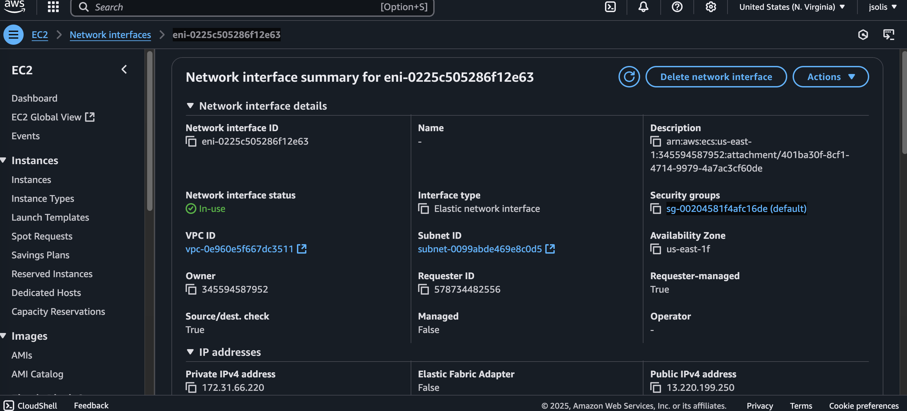

# 🚀 Despliegue de API Rest con FastAPI en AWS Fargate (ECS)

## 📋 Características del Servicio

- 🖥️ **Serverless**: AWS gestiona la infraestructura
- 🔒 **Sin acceso directo**: No necesitas gestionar servidores
- 📈 **Escalabilidad automática**: Múltiples contenedores y microservicios
- 💰 **Pago por uso**: Solo pagas por tiempo de ejecución y recursos usados
- 📚 **Curva de aprendizaje**: Requiere conocimiento de ECS, task definitions, IAM roles

## 🔍 ¿Qué son ECS y ECR?

### 🐳 Amazon ECS (Elastic Container Service)

- Es un servicio de orquestación de contenedores altamente escalable
- Permite ejecutar y escalar aplicaciones en contenedores
- Soporta Docker y permite ejecutar contenedores en servidores administrados por AWS
- Fargate es un motor de computación sin servidor para contenedores que funciona con ECS

### 📦 Amazon ECR (Elastic Container Registry)

- Es un registro de contenedores Docker completamente administrado
- Permite almacenar, administrar y desplegar imágenes de contenedores
- Se integra con ECS para facilitar el despliegue de aplicaciones
- Ofrece alta disponibilidad y durabilidad para tus imágenes de Docker

### 🔄 ¿Cómo trabajan juntos ECS y ECR?

#### 🤝 Relación y Complemento

- **ECR como Almacén**:

  - ECR actúa como el repositorio donde guardas tus imágenes Docker
  - Funciona como un "GitHub para contenedores"
  - Mantiene versiones de tus imágenes de forma segura

- **ECS como Ejecutor**:
  - ECS toma las imágenes almacenadas en ECR
  - Las despliega y ejecuta en contenedores
  - Gestiona el ciclo de vida de los contenedores

#### 💡 Flujo de Trabajo

1. Desarrollas tu aplicación y creas una imagen Docker
2. Subes la imagen a ECR (como si fuera un repositorio)
3. ECS lee la imagen desde ECR
4. ECS despliega y ejecuta los contenedores usando esa imagen

#### ⚡ Beneficios de Usar Ambos

- **Seguridad Integrada**:
  - Autenticación y autorización entre servicios
  - No necesitas credenciales adicionales
- **Despliegue Simplificado**:
  - Integración nativa entre servicios
  - Menos configuración manual
- **Gestión de Versiones**:
  - Control de versiones de imágenes
  - Rollback fácil a versiones anteriores
- **Escalabilidad**:
  - ECR escala automáticamente con tus necesidades
  - ECS maneja la escalabilidad de los contenedores

## 🤔 ¿Cuándo usar Fargate?

Considera usar Fargate si:

- 🏗️ Trabajas con varios contenedores en producción
- 📈 Necesitas escalabilidad automática
- 🚫 No quieres gestionar servidores
- 🔄 Quieres integrar CI/CD y despliegue automatizado

## 🛠️ Desarrollo Local

### 📋 Requisitos Previos

- 🐳 Docker instalado
- 📦 Git instalado

### 🚀 Comenzando

1. **Clonar el Repositorio**

```bash
git clone <url-del-repositorio>
cd api-01
```

2. **Construir y Ejecutar con Docker**

```bash
# Construir la imagen
docker build -t api-01 .

# Ejecutar el contenedor
docker run -p 8000:8000 api-01
```

### 📡 Endpoints de la API

```bash
# Endpoint principal
curl -X 'GET' 'http://localhost:81/' -H 'accept: application/json'

# Endpoint de items
curl -X 'GET' 'http://localhost/items/1?q=q' -H 'accept: application/json'
```

## ☁️ Despliegue en AWS

### 📋 Requisitos Previos

- ✅ Cuenta de AWS activa
- 🔑 Contectate con Par de llaves (.pem) para SSH, si no lo has echo
- 🐳 Docker instalado localmente
- 📦 Dockerfile listo

### 🪜 Pasos de Despliegue

#### 1️⃣ Crear Repositorio ECR

1. Busca "ECR" en AWS
2. Click en "Create repository"
3. Nombre: `api-python-fargate`
4. Guarda los comandos de subida

#### 2️⃣ Subir Imagen a ECR

```bash
# Login en ECR
aws ecr get-login-password --region tu-region | docker login --username AWS --password-stdin <tu_id>.dkr.ecr.tu-region.amazonaws.com

# Construir imagen
docker build -t api-python-fargate .

# Etiquetar imagen
docker tag api-python-fargate:latest <tu_id>.dkr.ecr.tu-region.amazonaws.com/api-python-fargate:latest

# Subir imagen
docker push <tu_id>.dkr.ecr.tu-region.amazonaws.com/api-python-fargate:latest
```

#### 3️⃣ Crear Clúster ECS

1. Busca "ECS" en AWS
2. Click en "Create cluster"
3. Selecciona "Networking only (Fargate)"
4. Nombre: `api-fargate-cluster`

#### 4️⃣ Crear Task Definition

1. Ve a Task Definitions > Create new
2. Tipo: Fargate
3. Nombre: `api-task`
4. Configuración:
   - CPU: 0.5 vCPU
   - RAM: 1 GB
   - Puerto: 81
   - Imagen: URI de ECR

#### 5️⃣ Crear Servicio ECS

1. En el clúster, click en "Create service"
2. Tipo: Fargate
3. Task Definition: `api-task`
4. Tareas: 1
5. Configura VPC y subnet pública
6. Security Group: Habilitar puerto 81

#### 6️⃣ Probar la Aplicación

##### 🔍 Encontrar la IP Pública

1. Ve a ECS > Clusters > Tu clúster
2. Click en "Tasks"
3. Selecciona la tarea RUNNING
4. Ve a "Network" > ENI ID
5. En EC2 > Network Interfaces, encuentra la IP pública



##### 🔧 Configurar Security Group

1. Ve a EC2 > Network Interfaces
2. Encuentra tu ENI
3. Click en el Security Group
4. Añade regla de entrada:
   - Type: Custom TCP
   - Protocol: TCP
   - Port: 81
   - Source: 0.0.0.0/0
   - (Opcional) IPv6: ::/0

##### 🚀 Acceder a la API

```
http://<IP-PUBLICA>:81
```

### ⚠️ Solución de Problemas

Si no puedes acceder:

1. Verifica el Security Group
2. Confirma que la tarea está RUNNING
3. Revisa los logs en ECS > Tasks > Logs
4. Espera ~30 segundos después de cambios en Security Group
